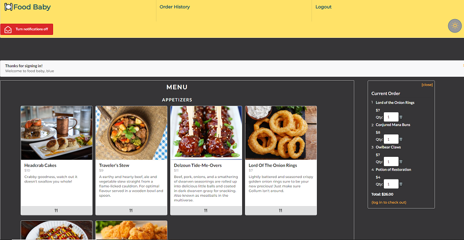

<!-- PROJECT LOGO -->
<br />
<p align="center">
  <a href="https://github.com/Nickhill2380/food-baby">
    
  </a>

  <h3 align="center"><strong>Food Baby</strong></h3>

  <p align="center">
    <!-- <a href="https://github.com/Nickhill2380/food-baby">View Demo</a>
    · -->
    <a href="https://github.com/Nickhill2380/food-baby/issues">Report Bug</a>
    ·
    <a href="https://github.com/Nickhill2380/food-baby/issues">Request Feature</a>
  </p>
</p>


<!-- TABLE OF CONTENTS -->
<details open="open" >
  <summary><h2 style="display: inline-block">Table of Contents</h2></summary>
  <ol>
    <li>
      <a href="#about-the-project">About The Project</a>
      <ul>
        <li><a href="#built-with">Built With</a></li>
      </ul>
    </li>
    <li>
      <a href="#getting-started">Getting Started</a>
      <ul>
        <li><a href="#prerequisites">Prerequisites</a></li>
        <li><a href="#installation">Installation</a></li>
      </ul>
    </li>
    <li><a href="#usage">Usage</a></li>
    <li><a href="#features">Features</a></li>
    <li><a href="#roadmap">Roadmap</a></li>
    <li><a href="#contact">Contact</a></li>
    <li><a href="#contributions">Contributions</a></li>
  </ol>
</details>


<!-- ABOUT THE PROJECT -->
## About The Project
<p align="center">
  <a href="https://food-babycmnw.herokuapp.com/">
    
  </a>
</p>

Food Baby is a collaborative work, user-focused MERN application. Food Baby provides an easily customizable food ordering app template that can be tailored to each business.
Food Baby's template system empowers restaurants with the accessibility and performance of popular delivery apps, without the fees. Restaurant owner's are able to modify and 
update menu items listings from within an owner dashboard, including uploading their own images. Food Baby's checkout feature is powered by Stripe.


### Built With

- [REACT](https://reactjs.org/) with [Semantic UI](https://react.semantic-ui.com/) and [Styled Components](https://styled-components.com/) for front end.
- [GraphQL](https://graphql.org/) with a [Node.js](https://nodejs.org/en/) and [Express.js](https://expressjs.com/) server.
- [Apollo Server](https://www.apollographql.com/docs/apollo-server/) for the query language.
- [MongoDB](https://www.mongodb.com/cloud/atlas) and [Mongoose ODM](https://mongoosejs.com/) for the database.
- [FireBase]() for notifications and image storage. 
- [Bcrypt](https://www.npmjs.com/package/bcrypt) and [JSONWebToken](https://www.npmjs.com/package/jsonwebtoken) for authentication.
- [Stripe](https://stripe.com/docs) for payment management.
- Production is deployed on [Heroku](https://www.heroku.com/).
- Languages used: JavaScript, CSS and HTML. 


<!-- GETTING STARTED -->
## Getting Started

### Prerequisites

- Please ensure you have a node.js integrated terminal before running the application. If not:
- Download [Node.js](https://nodejs.org/en/).

### Installation

1. Clone the repo
```sh
git clone git@github.com:Nickhill2380/food-baby.git
```
2. To download all application dependencies, in the project root directory, run:
```sh
npm install
```
3. Include `AUTH_SECRET` in an `.env` file located in the root of the server directory.
```JS
AUTH_SECRET = 'TEXT HERE';
```
4. To seed the database with mock data, in the root directory, run:
```sh
npm run seed
```
5. To begin application in localhost:
```sh
npm start
```


<!-- USAGE EXAMPLES -->
## Usage

Load web application from the [homepage](https://food-babycmnw.herokuapp.com/).

Restaurant owners will have access to a customized admin account in order to add, delete and modify menu listings. In order to test this feature:
- Admin accounts can be accessed by [logging](https://food-babycmnw.herokuapp.com/Login) into the app with the following credentials:
  - Email: admin@food-baby.com
  - Password: password12345

The admin account enables access to the owner dashboard. The live preview features allows users to observe their changes instantaneously. 
- Current Menu tab lists the current menu items and details. Each item has a button to either edit or delete selection. 
    - When editing current menu items, users will be able to update the name, price, description, course and image of each item. Users can save changes by clicking the save button at the bottom.
- Add Menu Item tab allows the addition of a new item into the listing. 
    - Users will need to input a name, price, description, select a course and upload an image for the new menu item before adding it by saving. 

Customers will be able to [sign up](https://food-babycmnw.herokuapp.com/signup) for a new account or [log in](https://food-babycmnw.herokuapp.com/Login) to a current account.
- To create an account, users will need to provide a first and last name, a valid email address and a password that is a minimum of 6 characters in length. 
- To log into an existing account, users will need to provide a registered email address and password.

<br />

All users will be required to be logged into an account in order to checkout.  
- In order to avoid any potential delay in service between the restaurant and customer, the checkout feature is designed to only succeed while connected to the internet. 

<br />

- Notifications may only be accessed by registered users. 

- The dark mode toggle is located at the bottom-right of the navigation bar. Once clicked, the icon will change into a sun or moon, depending on it's activated mode. 


<!-- FEATURES -->
## Features
- Includes authentication
- Mobile responsive
- Smooth user interface
- Notifications
- Light and dark mode toggle 
- Admin and user accounts
- Checkout feature
- Progressive web application


<!-- ROADMAP -->
## Roadmap

See the [open issues](https://github.com/Nickhill2380/food-baby/issues) for a list of proposed features (and known issues).


<!-- CONTACT -->
## Contact

Please feel free to reach out to us through email for additional questions at:
<br>
- Clu.Codes@gmail.com (Clu-Codes)
- Deckiedevs@gmail.com (DeckieDevs)
- Nickhill2380@gmail.com (Nickhill2380)
- Elysiayn@gmail.com (Elysiayn)


<!-- CONTRIBUTIONS -->
## Contributions
Visit our GitHub!
- [Clu-Codes](https://github.com/Clu-Codes)
- [DeckieDevs](https://github.com/DeckieDevs)
- [Nickhill2380](https://github.com/Nickhill2380)
- [Elysiayn](https://github.com/Elysiayn)
